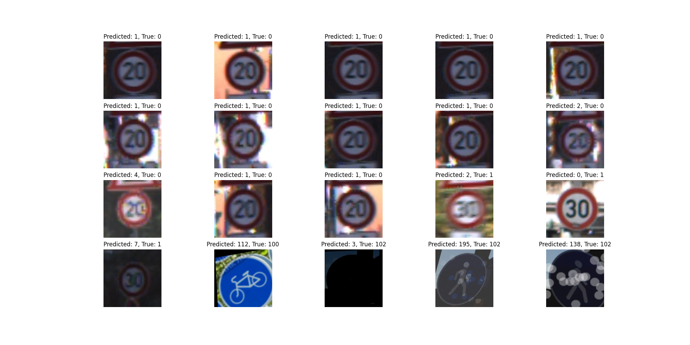
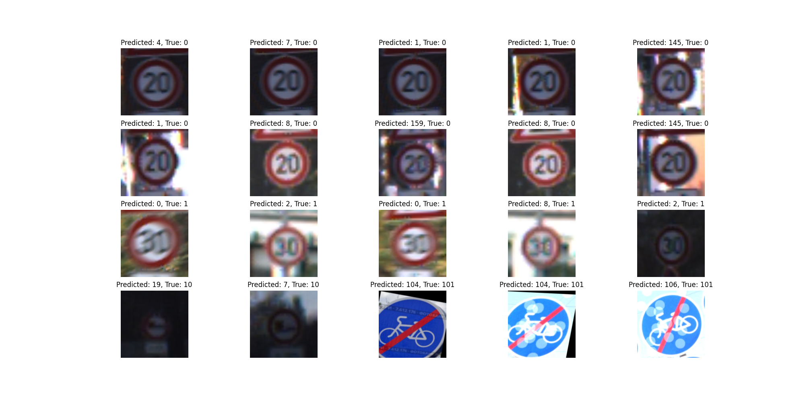
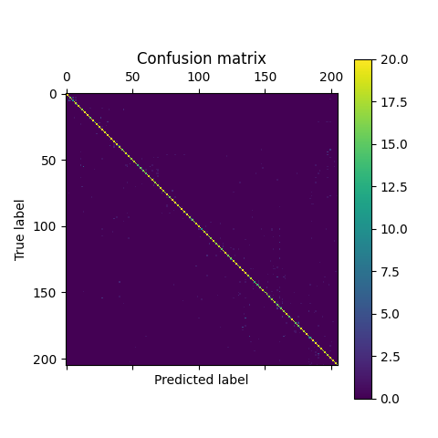
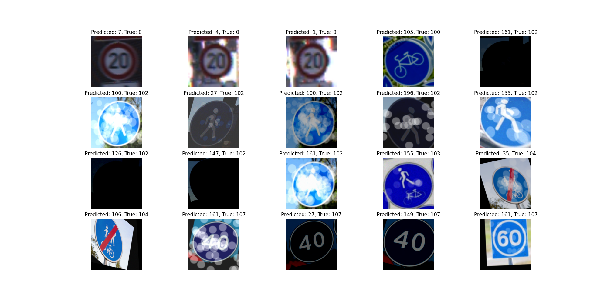
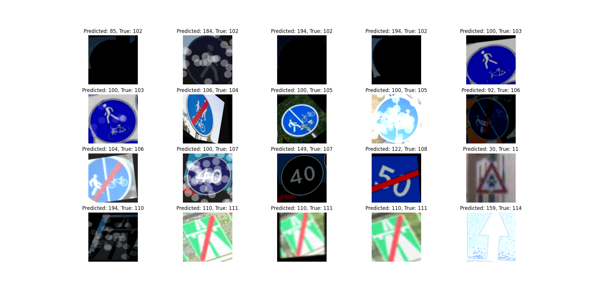
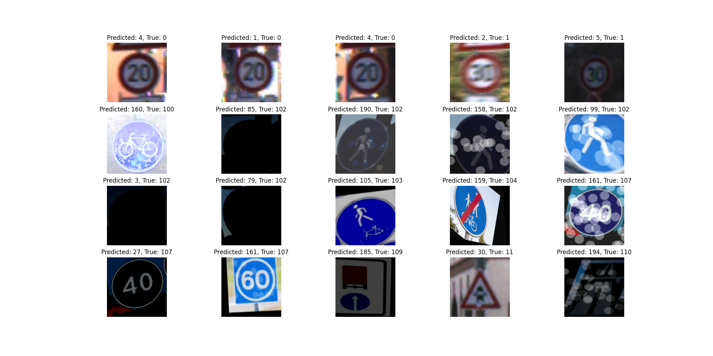
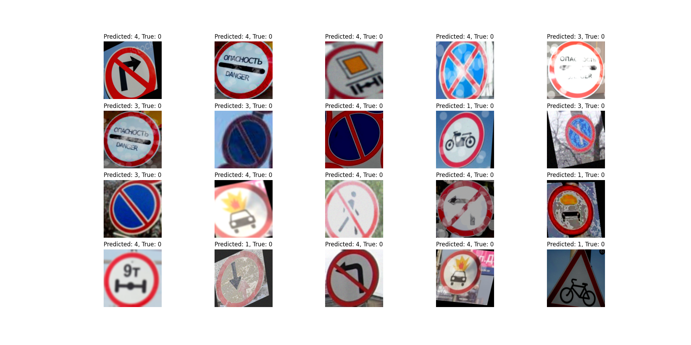

# Analiza danych

Dataset pochodzi z [Kaggle - traffic-signs-gtsrb-plus-162-custom-classes](https://www.kaggle.com/datasets/daniildeltsov/traffic-signs-gtsrb-plus-162-custom-classes)

Jest on podzielony na zestaw treningowy oraz testowy.

## Dane treningowe

Zestaw zawiera 97 426 obrazów, podzielonych na 205 klas.

Jak widać na rozkładzie zestaw nie jest zbalansowany.

Maksymalna ilosść obrazów w klasie to: 2243
Minimalna ilosść obrazów w klasie to: 173
Klasa z najwieksza iloscia obrazow to: 2
Klasa z najmniejsza iloscia obrazow to: 58

Do treningu wyciągnięte zostało losowo 170 obrazów z każdej klasy.

Przykładowe obrazy:

## Dane testowe

Zestaw zawiera 53 454 obrazów, podzielonych na 205 klas.

Jak widać na rozkładzie zestaw nie jest zbalansowany.

Maksymalna ilosść obrazów w klasie to: 650
Minimalna ilosść obrazów w klasie to: 60
Klasa z najwieksza iloscia obrazow to: 2
Klasa z najmniejsza iloscia obrazow to: 19

Do testowania wyciągnięte zostało losowo 20 obrazów każdej klasy.

Przykładowe obrazy:

## Przygotowanie danych

Przykładowe rozmiary:

| Wysokość | Szerokość | Wymiar obrazu |
|:---------|:----------|:--------------|
| 99       | 103       | 3             |
| 232      | 186       | 4             |
| 151      | 289       | 4             |
| 49       | 50        | 3             |
| 205      | 157       | 4             |

Na potrzeby normalizacji rozmiar został ujednolicony do 224x224x3.

Przykładowe obrazy po normalizacji:

Ze zbioru testowego został wydzielony zbiór walidacyjny.

Liczba rekordów w zbiorze treningowym: 27880

Liczba rekordów w zbiorze walidacyjnym: 6970

Liczba rekordów w zbiorze testowym: 4100

# Modele

## V1
class = CnnNet

### Architektura:

Prosty model z 7 warstw, zastosowano dropout o wartości 0.2 w celu uniknięcia przeuczenia się sieci. 
Każda kolejna warstwa zwiększała dwukrotnie ilość wymiarów i redukowała wielkosc obrazu o 50%.

| Warstwa | Opis |
|:--------|:--------|
| 1       | Conv2d 32, 3x3, padding=1 + ReLU + MaxPool2d 2x2 |
| 2       | Conv2d 64, 3x3, padding=1 + ReLU + MaxPool2d 2x2 |
| 3       | Conv2d 128, 3x3, padding=1 + ReLU + MaxPool2d 2x2 |
| 4       | Conv2d 256, 3x3, padding=1 + ReLU + MaxPool2d 2x2 |
| 5       | Conv2d 512, 3x3, padding=1 + ReLU + MaxPool2d 2x2 |
| 6       | Flatten + Dropout + Linear 512*7*7 -> 1024 + ReLU + Dropout + Linear 1024 -> num_classes 205 |
| 7       | Output 205 |

### Parametry:

| Parametr | Wartość |
|:--------|:--------|
| lr       | 0.001   |
| epochs   | 35      |
| batch_size | 64      |
| optimizer | Adam    |
| loss | CrossEntropyLoss |

### Wynik:

Czas treningu: około 40 minut

Skuteczność na zbiorze treningowym: 98.62%

Skuteczność na zbiorze walidacyjnym: 94.79%

Skuteczność na zbiorze testowym: 83.6%

Z błędów wynika, że model poprawnie sklasyfikował znaki ograniczenia prędkości, miał jednak problem z dopasowaniem cyfry na znakach.
Znak droga rowerowa został błędnia sklasyfikowany i pomylony ze znakiem droga dla samochodów, kolor sie zgadza jednak kształt i symbol już nie.

## V2
class = CnnNetV2

### Architektura:

Model inspirowany GoogleNet. Na pierwszy blok składa się warstwa konwolucyjna która na wejściu przyjmuje 3 kanały i zwraca 32 kanały, które następnie są normalizowane i
przekazane do kolejnej warstwy konwolucyjnej zwracającej 64 kanały. Następuje normalizacji i przekazanie do ostatniej warstwy zwracającej 1 kanał i ostatnia jest redukcja
wymiaru o połowę. Kolejne 3 bloki są analogiczne z tą różnicą, że pierwsza warstwa ma jeden kanał na wejściu. Ostatni blok został pozbawiony redukcji do jednego wymiaru.

| Warstwa | Opis |
|:--------|:--------|
|1 | Conv2d 32, 3x3, padding=1 + BatchNorm2d + ReLU + Conv2d 64, 3x3, padding=1 + BatchNorm2d + ReLU + Conv2d 1, 1x1 + ReLU + MaxPool2d 2x2 |
|2 | Conv2d 32, 3x3, padding=1 + BatchNorm2d + ReLU + Conv2d 64, 3x3, padding=1 + BatchNorm2d + ReLU + Conv2d 1, 1x1 + ReLU + MaxPool2d 2x2 |
|3 | Conv2d 32, 3x3, padding=1 + BatchNorm2d + ReLU + Conv2d 64, 3x3, padding=1 + BatchNorm2d + ReLU + Conv2d 1, 1x1 + ReLU + MaxPool2d 2x2 |
|4 | Conv2d 32, 3x3, padding=1 + BatchNorm2d + ReLU + Conv2d 64, 3x3, padding=1 + BatchNorm2d + ReLU + Conv2d 1, 1x1 + ReLU + MaxPool2d 2x2 |
|5 | Conv2d 32, 3x3, padding=1 + BatchNorm2d + ReLU + Conv2d 64, 3x3, padding=1 + BatchNorm2d + ReLU + Conv2d 1, 1x1 + ReLU + MaxPool2d 2x2 |
|6 | Flatten + Dropout + Linear 512*7*7 -> 1024 + ReLU + Dropout + Linear 1024 -> num_classes 205 |
|7 | Output 205 |

### Parametry:

| Parametr | Wartość          |
|:--------|:-----------------|
| lr       | 0.001            |
| epochs   | 50               |
| batch_size | 64               |
| optimizer | Adam             |
| loss | CrossEntropyLoss |

### Wynik:

Czas treningu: około 90 minut

Skuteczność na zbiorze treningowym: 98.4%

Skuteczność na zbiorze walidacyjnym: 93.05%

Skuteczność na zbiorze testowym: 80.7%

Z błędów wynika, że model poprawnie sklasyfikował znaki ograniczenia prędkości, miał jednak problem z dopasowaniem cyfry na znakach.
Znaki końca drogi rowerowej zostały sklasyfikowane jako znak końca drogi rowerowej i przejścia dla pieszych, niewielka pomyłka.

## V3
class = CnnNetV3

### Architektura:

Identyczna jak w V1, jedyną różnicą jest wykożystanie nn.Sequential aby zdefiniować bloki konwolucyjne dla poprawienia czytelności.

### Parametry:

| Parametr | Wartość          |
|:--------|:-----------------|
| lr       | 0.001            |
| epochs   | 30               |
| batch_size | 64               |
| optimizer | Adam             |
| loss | CrossEntropyLoss |

### Wynik:

Czas treningu: około 40 minut

Skuteczność na zbiorze treningowym: 98.81%

Skuteczność na zbiorze walidacyjnym: 96.88%

Skuteczność na zbiorze testowym: 88.6%

Z błędów wynika, że model poprawnie sklasyfikował znaki ograniczenia prędkości, miał jednak problem z dopasowaniem cyfry na znakach.
W tym przypadku znaki informacyjne zostały pomylone z innymi znakami informacyjnymi, łaczył je tylko kolor.

## V4
class = CnnNetV4

### Architektura:

Pierwsza architektura przynosiła do tej pory najlepszy wynik więc postnowiłem ją rozwijać, dodałem wykorzystanie nn.Sequential aby zdefiniować bloki konwolucyjne dla poprawienia czytelności.
Dodatkowo po każdej warstwie konwolucyjnej jest normalizacja.

| Warstwa | Opis |
|:--------|:--------|
| 1       | Conv2d 32, 3x3, padding=1 + BatchNorm2d + ReLU + MaxPool2d 2x2 |
| 2       | Conv2d 64, 3x3, padding=1 + BatchNorm2d + ReLU + MaxPool2d 2x2 |
| 3       | Conv2d 128, 3x3, padding=1 + BatchNorm2d + ReLU + MaxPool2d 2x2 |
| 4       | Conv2d 256, 3x3, padding=1 + BatchNorm2d + ReLU + MaxPool2d 2x2 |
| 5       | Conv2d 512, 3x3, padding=1 + BatchNorm2d + ReLU + MaxPool2d 2x2 |
| 6       | Flatten + Dropout + Linear 512*7*7 -> 1024 + ReLU + Dropout + Linear 1024 -> num_classes 205 |
| 7       | Output 205 |

### Parametry:

| Parametr | Wartość |
|:--------|:--------|
| lr       | 0.001   |
| epochs   | 35      |
| batch_size | 64      |
| optimizer | Adam    |
| loss | CrossEntropyLoss |

### Wynik:

Czas treningu: około 40 minut

Skuteczność na zbiorze treningowym: 87.33%

Skuteczność na zbiorze walidacyjnym: 96.97%

Skuteczność na zbiorze testowym: 88.7%

Z błędów wynika, że model poprawnie sklasyfikował znaki ograniczenia prędkości, miał jednak problem z dopasowaniem cyfry na znakach.
Znaki o nakazie prędkości zostły pomylone ze znakami zawierającymi numery dróg. Znaki przejścia dla pieszych i drogi rowerowej zostały pomylone ze znakami zawierającymi oba te symbole razem.

## V5
class = CnnNetV5

### Architektura:

Identyczna jak w v4. Zwiększyłem ilość epok do 100 oraz dodałem zmniejszający się learning rate jeśli przez 5 epok nie nastąpiłą poprawa wartości funkcji straty.

### Parametry:

| Parametr | Wartość          |
|:--------|:-----------------|
| lr       | 0.001 - 0.0005   |
| epochs   | 100              |
| batch_size | 64               |
| optimizer | Adam             |
| loss | CrossEntropyLoss |

### Wynik:

Czas treningu: około 110 minut

Skuteczność na zbiorze treningowym: 99.82%

Skuteczność na zbiorze walidacyjnym: 99.0%

Skuteczność na zbiorze testowym: 94.7%

Znak końca autostardy został pomylony ze znakiem początku autostrady. Reszta znaków albo je nieczytelna i cieżka do odczytania nawet przez człowieka lub są to niewielkie pomyłki symboli człowieka i roweru lub obu razem.

## V6
class = CnnNetV5

### Architektura:

Założenia z poprzedniej wersji, jednak brak ograniczenia na ilość epok, trening skończył się gdy poprawa nie następowałą przez 10 kolejnych epok.

### Parametry:

| Parametr | Wartość          |
|:--------|:-----------------|
| lr       | 0.001 - 0.0002   |
| epochs   | 132              |
| batch_size | 64               |
| optimizer | Adam             |
| loss | CrossEntropyLoss |

### Wynik:

Czas treningu: około 160 minut

Skuteczność na zbiorze treningowym: 99.96%

Skuteczność na zbiorze walidacyjnym: 98.95%

Skuteczność na zbiorze testowym: 94.34%

Z błędów wynika, że model poprawnie sklasyfikował znaki ograniczenia prędkości, miał jednak problem z dopasowaniem cyfry na znakach.
Znaki o nakazie prędkości zostły pomylone ze znakami zawierającymi numery dróg. Znaki pod dużym kątem zostały pomylone ze znakami zawierającymi nazwę miejscowości, prawdopodobnie pod dużym kontem ciężko jest modelowi dopasować kształt.

# Zmeniejszenie ilości klas

Ze względu na małą ilość próbek w każdej klasie po zbalansowaniu, zdecydowaliśmy zmniejszyć ilość klas przez połączenie ich w kategorie.

0 : prohibition

1 : warning

2 : information

3 : mandatory

4 : supplements

5 : cities

## Dane treningowe

Zestaw zawiera 96 619 obrazów, podzielonych na 6 klas.

Jak widać na rozkładzie zestaw nie jest zbalansowany.

Maksymalna ilosść obrazów w klasie to: 28 421
Minimalna ilosść obrazów w klasie to: 7 454
Klasa z najwieksza iloscia obrazow to: 0
Klasa z najmniejsza iloscia obrazow to: 5

Do treningu wyciągnięte zostało losowo 11 000 obrazów z każdej klasy.

## Dane testowe

Zestaw zawiera 52 698 obrazów, podzielonych na 6 klas.

Jak widać na rozkładzie zestaw nie jest zbalansowany.

Maksymalna ilosść obrazów w klasie to: 14 862
Minimalna ilosść obrazów w klasie to: 2 520
Klasa z najwieksza iloscia obrazow to: 2
Klasa z najmniejsza iloscia obrazow to: 5

Do testowania wyciągnięte zostało losowo 6 000 obrazów każdej klasy.

## V7
class = CnnNetV5

### Architektura:

Model uczył się bardzo szybko, więc zmienione zostały wartości early stopping aby szybciej kończył. Threshold zmieiony z 0.0001 na 0.001,
dodatkowo zmiana learning rate następowała już po 2 epokach a po 3 nauka została przerywana.

### Parametry:

| Parametr | Wartość          |
|:--------|:-----------------|
| lr       | 0.001 - 0.0007   |
| epochs   | 14               |
| batch_size | 64               |
| optimizer | Adam             |
| loss | CrossEntropyLoss |

### Wynik:

Czas treningu: około 30 minut

Skuteczność na zbiorze treningowym: 99.61%

Skuteczność na zbiorze walidacyjnym: 99.54%

Skuteczność na zbiorze testowym: 89.29%

Pomyłki głowne między klasami 0 i 4. Prawdopodobnie przez dużą ilość białej przestrzeni występującej na znakach.